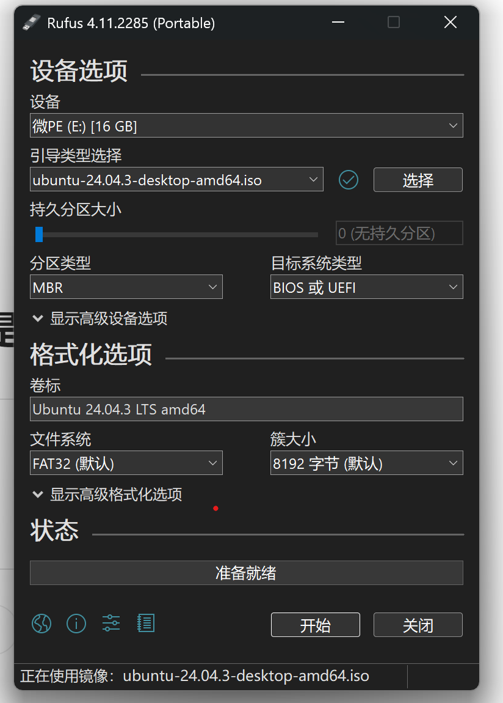

# 安装Windows系统

- 使用微PE即可：[微PE工具箱 - 下载](https://www.wepe.com.cn/download.html)

- 选择安装PE到U盘，找不到U盘说明电脑识别有问题，最好换电脑或者u口

- iso镜像复制到U盘

- 

# 安装Ubuntu系统

- 下载iso镜像文件
  
  - 使用国内源下载：[清华大学开源软件镜像站](https://mirrors.tuna.tsinghua.edu.cn/ubuntu-releases/)

- 制作启动盘
  
  - 下载：[Rufus - 轻松创建 USB 启动盘](https://rufus.ie/zh/)，选择便携版即可
  
  - 选择iso文件，其他使用默认配置即可
  
  
