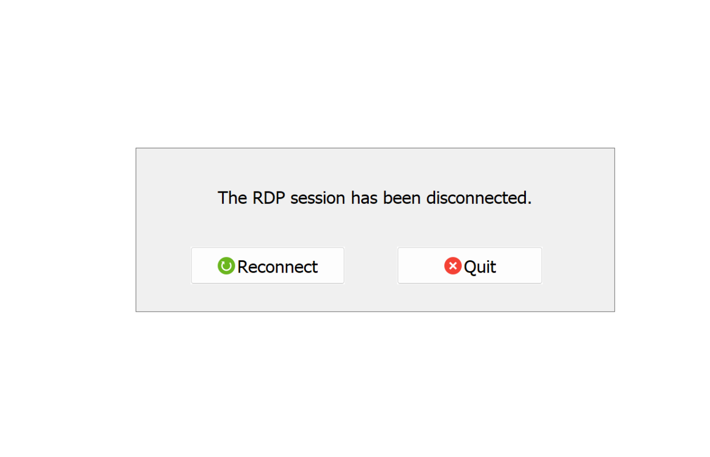
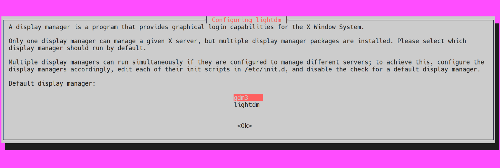

# 问题：连接闪退



这个问题是 Windows 远程桌面 (RDP) 连接 Ubuntu 时非常经典和常见的一个问题。 “闪退”现象通常意味着**连接已经建立，但在Ubuntu端启动图形化桌面环境时失败了**，导致会话立即被终止。

根本原因在于，Ubuntu 默认的桌面环境 (GNOME) 与 `xrdp`（Ubuntu上实现RDP协议的服务）的兼容性不佳。

# 安装并配置兼容性更好的桌面环境 (XFCE)

这是最推荐的解决方案，因为它最稳定、资源占用也较少。

## 第1步：在 Ubuntu 上安装 XFCE 桌面环境

打开 Ubuntu 终端运行以下命令：

```bash
sudo apt update
sudo apt install xfce4 -y #第2步：配置 XRDP 使用 XFCE
```

安装时会弹出如下窗口，选择lightdm：



安装好 XFCE 后，我们需要告诉 `xrdp`，当有远程连接请求时，应该启动 XFCE 桌面而不是默认的 GNOME。

## 第2步：修改 `xrdp` 的全局启动脚本

这个方法比修改用户个人的 `.xsession` 文件更可靠。我们将直接告诉 `xrdp` 服务，为所有连接都启动 `xfce4-session`。

### 编辑 `startwm.sh` 文件

在您的Ubuntu终端中，使用 `nano` 编辑器打开这个文件：

```bash
sudo nano /etc/xrdp/startwm.sh
```

### 修改文件内容

在最后两行（通常是 `test -x ...` 和 `exec ...` 这两行）注释掉（在行首加 `#`），然后添加 `startxfce4`，像这样：

```bash
# ... 文件其他内容 ...

# Comment out the original lines:
# test -x /etc/X11/Xsession && exec /etc/X11/Xsession
# exec /bin/sh /etc/X11/Xsession

# Add this line to start XFCE
startxfce4
```

## 第3步：重启 XRDP 服务

为了让配置生效，需要重启 `xrdp` 服务：

```bash
sudo systemctl restart xrdp
```

## 第4步：重新连接

现在，回到你的 Windows 电脑，再次启动远程桌面连接。输入 Ubuntu 的 IP 地址、用户名和密码。此时应该就能成功进入一个灰蓝色调、界面简洁的 XFCE 桌面了。

## 如果上述方案无效，请进行以下检查

### 1. 检查防火墙状态

确保 Ubuntu 的防火墙没有阻止远程桌面连接的端口（默认为 `3389`）。

```bash
# 允许 3389 端口的TCP连接
sudo ufw allow 3389/tcp

# 重启防火墙使规则生效
sudo ufw reload
```

### 2. 检查 `xrdp` 服务状态

确认 `xrdp` 服务是否正在正常运行。

```bash
sudo systemctl status xrdp
```

如果看到 `active (running)` 的字样，说明服务是正常的。如果有错误，可以根据提示进行排查。

### 3. 检查 `.xsession` 文件权限

极少数情况下，可能是文件权限问题。确保 `.xsession` 文件是可读的。

```bash
ls -l ~/.xsession
```