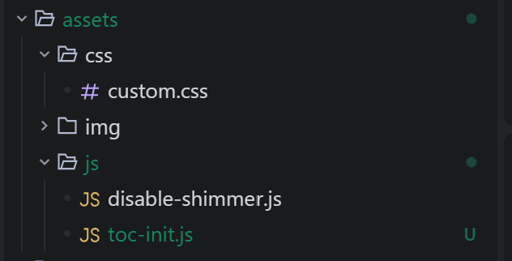
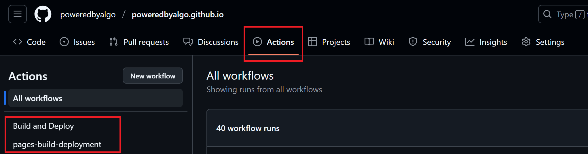
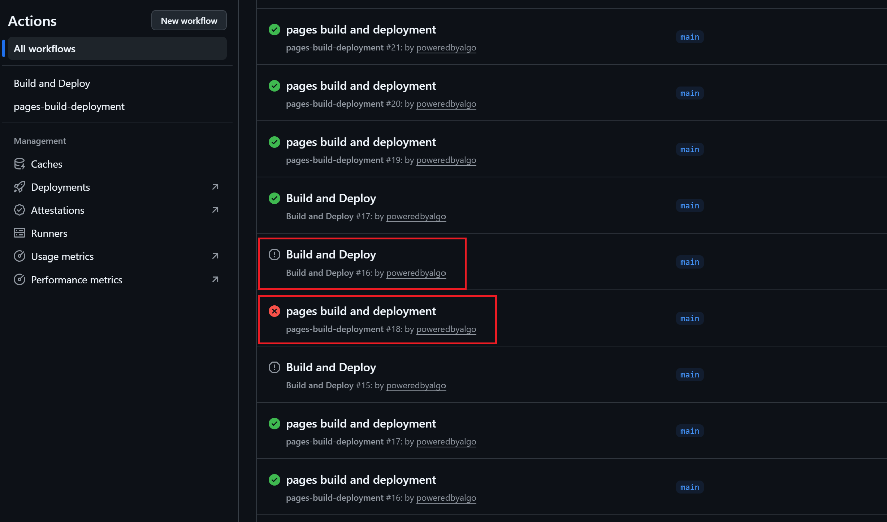
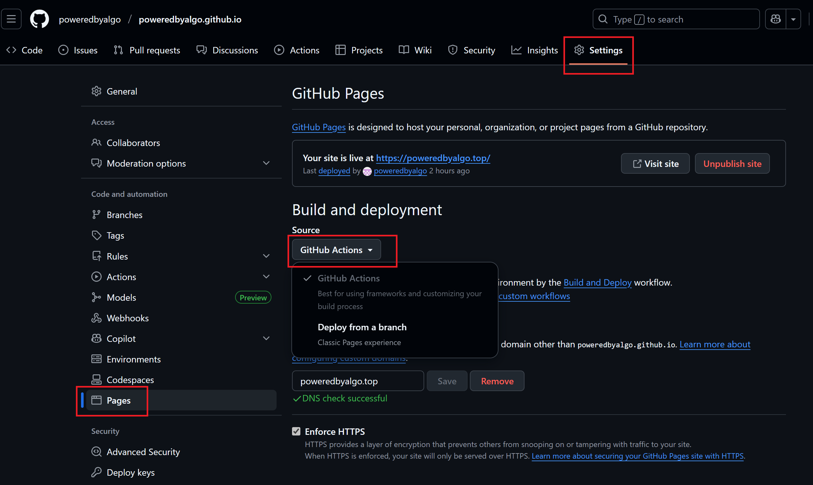

## Jekyll Chripy启用自定义JS脚本与CSS样式

### 创建自定义JS脚本与CSS样式文件



### 创建自定义html引入JS脚本与CSS样式文件

在`_includes`目录下创建`custom-head.html`（任意名称都可）

```html
<!-- 自定义CSS来禁用shimmer效果 -->
<link rel="stylesheet" href="/assets/css/custom.css">

<!-- 自定义JavaScript来禁用shimmer效果 -->
<script src="/assets/js/disable-shimmer.js"></script>

<!-- TOC初始化脚本 -->
<script src="/assets/js/toc-init.js"></script>
```

### 引入自定义html

在`_includes`目录下创建`metadata-hook.html`

```html

```

## Github Pages工作流冲突

### 点击Actions会看见两条工作流

- `pages-build-deployment`为Github Pages默认工作流且无法被禁用

- `Build and Deploy`为项目自定义的工作流，对应`.github/workflows/pages-deploy.yml`



### 存在的问题

- push时会同时触发两个工作流，容易出现因竞争导致deploy失败
- 若`pages-build-deployment`在` Build and Deploy `后执行，则会覆盖正确的deploy结果，导致Github Pages无法访问



### 解决办法

**操作步骤：Settings --> Pages --> Build and deployment --> Source --> Github Actions**

配置选择Github Actions后就只会使用自定义的工作流，`pages-build-deployment`就不会被触发啦~



## Ubuntu24.04 配置Docker镜像源失败

### 问题表现

能成功配置国内docker镜像源且能正常拉取hello-world镜像，但下载其他镜像报错：

```bash
[+] Running 1/1
 ✘ n8n Error Get "https://registry-1.docker.io/v2/": net/http: request ca...           15.3s 
Error response from daemon: Get "https://registry-1.docker.io/v2/": net/http: request canceled while waiting for connection (Client.Timeout exceeded while awaiting headers)
```

### 解决办法

设置DNS服务器为：8.8.8.8, 114.114.114.114 等

