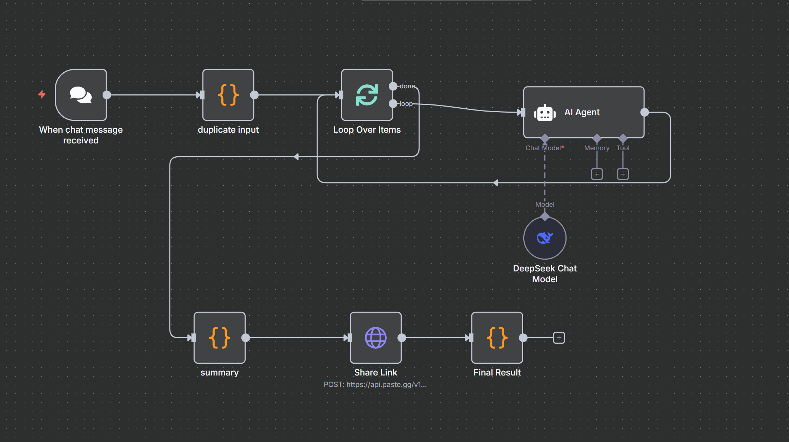
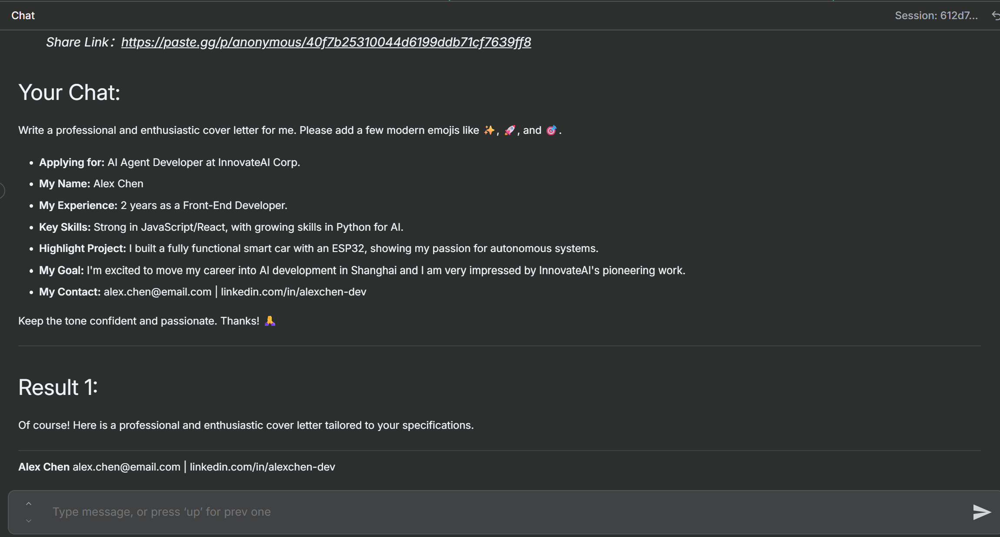
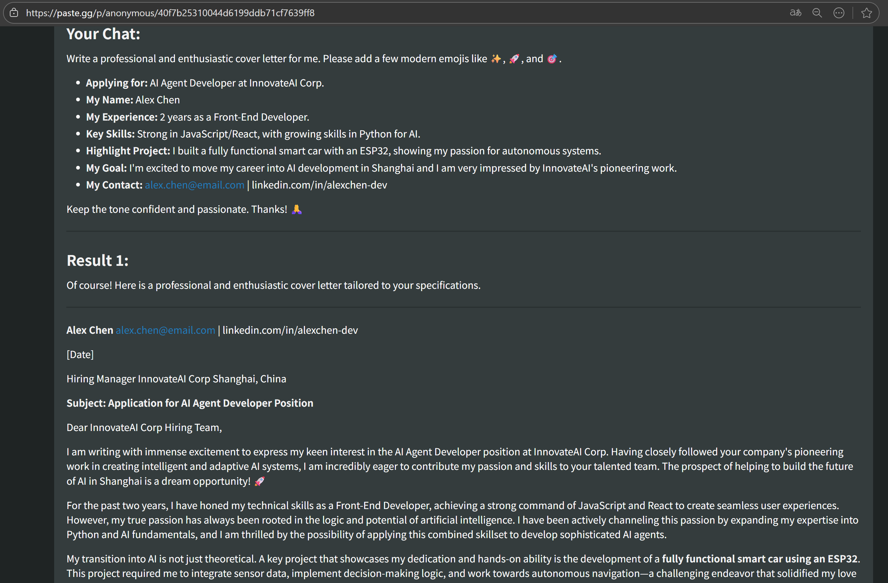
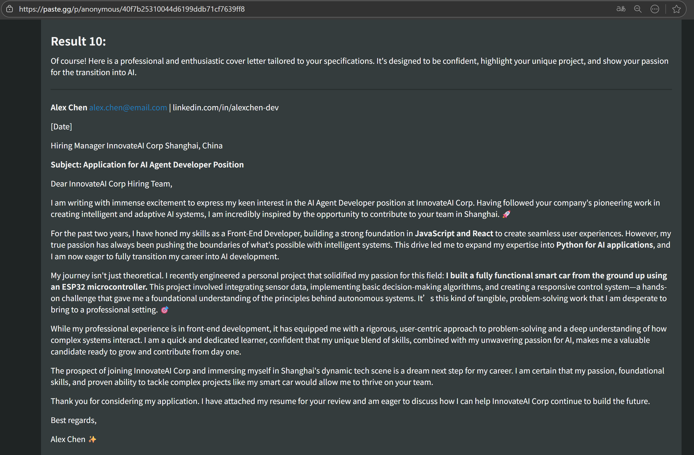

## Agent编制

其实功能很简单就是通过N8N将1个问题问10遍，最后得到10个答案，再将答案汇总展示并给出可在线访问链接。

通过API：https://api.paste.gg/v1/pastes，将markdown发布并得到可在线访问的URL



## Agent发布

### 示例提示词

Write a professional and enthusiastic cover letter for me. Please add a few modern emojis like ✨, 🚀, and 🎯.

- **Applying for:** AI Agent Developer at InnovateAI Corp.
- **My Name:** Alex Chen
- **My Experience:** 2 years as a Front-End Developer.
- **Key Skills:** Strong in JavaScript/React, with growing skills in Python for AI.
- **Highlight Project:** I built a fully functional smart car with an ESP32, showing my passion for autonomous systems.
- **My Goal:** I'm excited to move my career into AI development in Shanghai and I am very impressed by InnovateAI's pioneering work.
- **My Contact:** alex.chen@email.com | linkedin.com/in/alexchen-dev

Keep the tone confident and passionate. Thanks! 🙏

### 图片简介

#### 问答示例



#### 问答分享





### Agent介绍

#### OVERVIEW

Submit a single prompt and receive ten unique responses from the DeepSeek AI model simultaneously. This tool is designed to rapidly brainstorm ideas, compare different angles, and find the best possible answer by exploring the model's creative diversity, with results made instantly shareable via a web link.

#### AGENT DESCRIPTION

Have you ever asked an AI a question and felt the answer was good, but not quite perfect? Or perhaps you're brainstorming and need more than just one idea? Re-submitting the same prompt over and over is tedious and slow. To solve this problem, I created this AI agent that automates the process. It takes your single question and runs it through the DeepSeek Chat Model ten times in parallel, harnessing the inherent creativity of the AI to generate a wide spectrum of answers from the same starting point. All ten responses are then bundled together for you, and for ultimate convenience, a shareable link (valid for 7 days) is automatically generated.

#### PRODUCT ADVANTAGES

- **Massive Parallel Processing:** Instead of running prompts one by one, this agent sends ten requests simultaneously, saving you significant time and effort in creative exploration and data gathering.

- **Enhanced Creative Output:** By generating ten variations for a single prompt, you can easily compare nuances, discover unexpected ideas, and select the most fitting response from a diverse pool of options.

- **Instant & Easy Sharing:** Results are not only returned directly but also hosted on a temporary webpage, allowing you to share your findings with a simple link, perfect for collaboration or feedback.

#### KEY FEATURES

- Accepts a single text prompt as input.
- Executes ten parallel API calls to the DeepSeek Chat Model.
- Aggregates all ten generated responses into a single, consolidated result.
- Generates a unique, shareable URL for the aggregated results.
- The generated link remains active for 7 days for temporary sharing.

#### PROMPT

- Enter the question or prompt you want to explore into the input field. (Required)
- Submit the form and wait for the ten aggregated responses and the shareable link to be generated.

## 备忘：Ubuntu 24.04 永不挂起

`systemd` 是现代Linux系统的核心，它负责管理包括电源状态在内的各种系统服务。通过 `systemd` 来禁用挂起/休眠是最彻底和可靠的方法。

这个方法是通过**屏蔽 (mask)** 相关的 `systemd` 目标 (target) 来实现的。被屏蔽的服务将无法被任何程序或事件启动。

打开终端，执行以下命令：

```bash
sudo systemctl mask sleep.target suspend.target hibernate.target hybrid-sleep.target
```

**命令解释:**

- `sudo systemctl mask`: 这个命令会创建一个指向 `/dev/null` 的符号链接，使得这些服务单元文件无法被加载，从而彻底禁用它们。
- `sleep.target`: 控制所有睡眠状态的总目标。
- `suspend.target`: 控制系统挂起（内存不断电）。
- `hibernate.target`: 控制系统休眠（内存数据存入硬盘后断电）。
- `hybrid-sleep.target`: 混合挂起（数据存入硬盘，同时内存保持通电）。

执行此命令后，你的系统将无法进入任何形式的睡眠或挂起状态，无论是通过菜单、合上盖子还是超时。这是实现“永不挂起”最强有力的方式。

**如何恢复？** 如果你以后想恢复挂起功能，只需 `unmask` 它们即可：

```bash
sudo systemctl unmask sleep.target suspend.target hibernate.target hybrid-sleep.target
```
