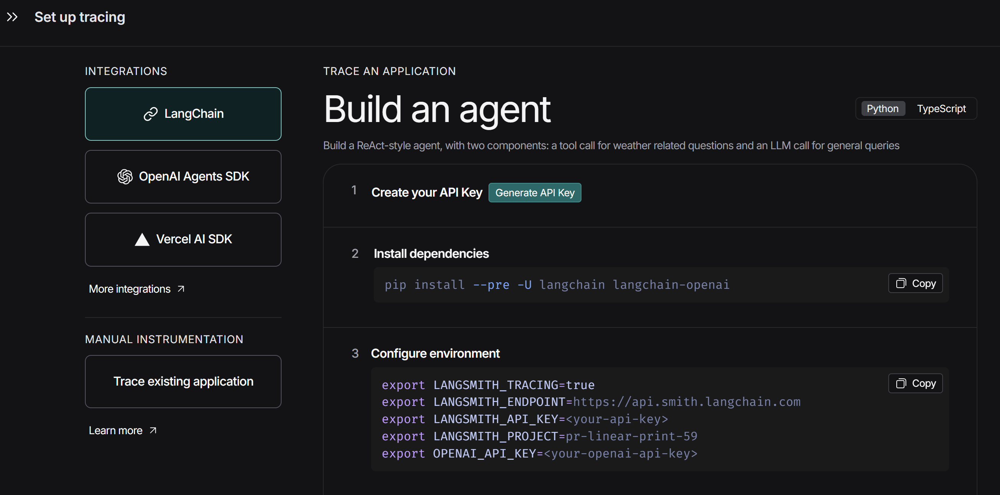
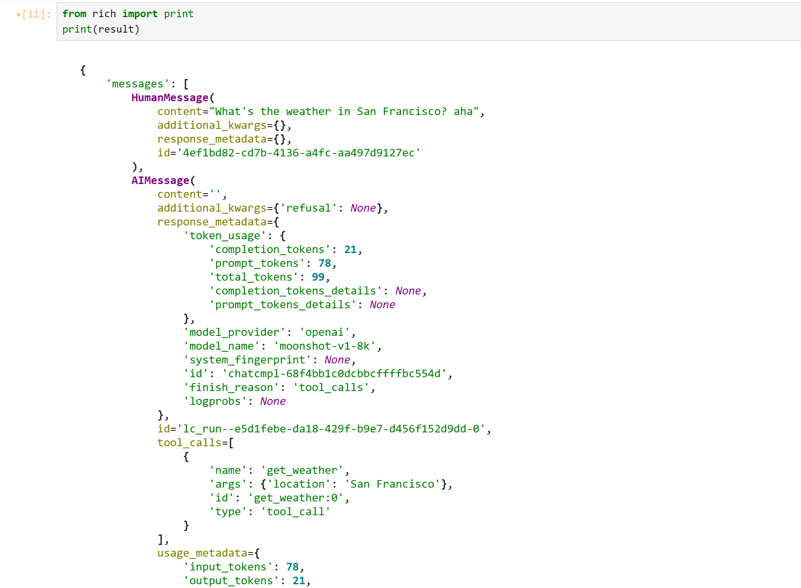

## 基于Docker部署LangChain开发环境

### Dockerfile

```dockerfile
# 1. 使用官方Python 3.11镜像
FROM python:3.11-slim

# 2. (可选) 安装 uv 来加速
#    您甚至可以换回 "pip install --no-cache-dir ..."
RUN pip install uv

# 3. 设置工作目录
WORKDIR /app

# 4. 复制依赖文件
COPY requirements.txt .

# 5. 安装依赖
#    这就是一个最简单、只管隔离的安装命令
#    --no-cache-dir 确保缓存不会被打包进镜像，保持镜像苗条
RUN uv pip install --system --no-cache-dir -r requirements.txt

# 6. 复制您的代码
#    注意：我们仍然使用 docker-compose 的 "volumes" 来覆盖它
#    这使得您在WSL中的代码可以实时同步
COPY ./src /app/src

# 7. 保持容器运行
CMD ["tail", "-f", "/dev/null"]
```

### docker-compose.yml

```yaml
services:
  langchain_dev:
    # 依然使用当前目录的 Dockerfile 构建
    build: .
    image: langchain-env:latest
    env_file: .env  # 会将.env文件中的变量自动export为环境变量
    # !!! 核心功能：挂载卷 !!!
    # 您的 WSL 代码 ('.') 实时同步到容器的 /app
    volumes:
      - .:/app
      
    # Jupyter Lab 端口映射
    ports:
      - "8888:8888"
      
    # 保持容器在前台运行
    stdin_open: true
    tty: true
```

### start-jupyter.sh

```bash
#!/bin/bash

# 启动Docker容器中的Jupyter Lab脚本
# 该脚本会自动构建镜像、启动容器并在容器中启动Jupyter Lab

echo "🚀 正在启动 Jupyter Lab..."

# 检查Docker是否正在运行
if ! docker info > /dev/null 2>&1; then
    echo "❌ Docker 未运行，请先启动 Docker"
    exit 1
fi

# 检查是否提供了build参数
if [ "$1" = "build" ]; then
    echo "📦 正在构建和启动容器..."
    docker-compose up -d --build
else
    echo "📦 正在启动容器（不重新构建）..."
    docker-compose up -d
fi

# 等待容器完全启动
echo "⏳ 等待容器启动..."
sleep 5

# 检查容器是否正常运行
if ! docker-compose ps | grep -q "Up"; then
    echo "❌ 容器启动失败"
    exit 1
fi

echo "✅ 容器启动成功"

# 在容器中启动Jupyter Lab
echo "🔥 正在启动 Jupyter Lab..."
docker-compose exec -d langchain_dev bash -c "jupyter lab --ip=0.0.0.0 --port=8888 --no-browser --allow-root --NotebookApp.token='' --NotebookApp.password='' > jupyter.log 2>&1"

# 等待Jupyter Lab启动
sleep 5

# 检查Jupyter Lab是否在运行 pgrep -f jupyter-lab不可用
if docker-compose exec langchain_dev bash -c "grep -l 'jupyter-lab' /proc/[0-9]*/cmdline 2>/dev/null | wc -l" > /dev/null 2>&1; then
    echo "✅ Jupyter Lab 启动成功！"
    echo "🌐 访问地址: http://localhost:8888"
    echo "📊 日志文件: docker-compose exec langchain_dev cat jupyter.log"
else
    echo "❌ Jupyter Lab 启动失败"
    echo "📊 查看日志: docker-compose exec langchain_dev cat jupyter.log"
    exit 1
fi

echo ""
echo "📋 常用命令:"
echo "  查看日志: docker-compose exec langchain_dev cat jupyter.log"
echo "  停止服务: ./stop-jupyter.sh"
echo "  进入容器: docker-compose exec langchain_dev bash"
```

#### pgrep命令替换

```bash
# pgrep -f jupyter-lab 中 pgrep在基础linux镜像中并没有安装，改为使用更底层的grep
grep -l 'jupyter-lab' /proc/[0-9]*/cmdline 2>/dev/null | wc -l" 
```

**命令分解：**

1. `/proc/[0-9]*/cmdline`:
   - Linux 内核会把每个正在运行的进程（PID）作为一个目录放在 `/proc` 下，例如 `/proc/123`。
   - `[0-9]*` 是一个通配符，表示“所有纯数字的目录”。
   - `cmdline` 是每个 PID 目录下的一个特殊文件，它**包含了启动该进程的完整命令** (这正是 `pgrep -f` 要搜索的地方)。
2. `grep -l "jupyter-lab" ...`:
   - `grep` 在所有这些 `cmdline` 文件中搜索 "jupyter-lab" 字符串。
   - `-l` (小写的L) 是关键：它告诉 `grep` **不要打印匹配的\*内容\*，而是打印匹配的\*文件名\***。
   - 输出会是这样：`/proc/123/cmdline`
3. `2>/dev/null`:
   - 在搜索时，有些进程可能会瞬间消失，导致 `grep` 报“文件未找到”的错误。`2>/dev/null` 会把这些错误信息重定向并丢弃，保持输出干净。
4. `wc -l`:
   - 计算行数，不为0则说明有进程

### requirements.txt

```yaml
# LangChain核心库
langchain>=1.0.0
langchain-core>=1.0.0

# LangChain集成包
langchain-openai>=1.0.0
langchain-anthropic>=1.0.0

# 常用工具和依赖
python-dotenv>=1.0.0
pydantic>=2.0.0
requests>=2.31.0

# Jupyter Lab
jupyterlab>=4.0.0
ipykernel>=6.25.0

jupyterlab-code-formatter<=3.0.2
jupyterlab-lsp>=4.2.0
jupyterlab-widgets>=3.0.0

# 输出美化工具
rich>=13.0.0
prettytable>=3.0.0
tabulate>=0.9.0

# 数据可视化增强
plotly>=5.0.0
seaborn>=0.12.0
matplotlib>=3.7.0

# 代码质量工具
black>=23.0.0
isort>=5.12.0
flake8>=6.0.0
```

### Demo代码

#### Tools

```python
from langchain.tools import tool
from langchain.agents import create_agent

@tool
def search(query: str) -> str:
    """Search for information."""
    return f"Results for: {query}"

@tool
def get_weather(location: str) -> str:
    """Get weather information for a location."""
    return f"Weather in {location}: Sunny, 72°F"

tools = [search, get_weather]
```

#### Agents

```python
from langchain.agents import create_agent
from langchain_openai import ChatOpenAI
import os
from rich import print

# 1. 实例化模型
model_kimi_k2 = ChatOpenAI(
    openai_api_key=os.getenv('KIMI_API_KEY'),  # Kimi API-Key
    openai_api_base=os.getenv('KIMI_API_BASE_URL'),
    model="kimi-k2-0905-preview",      # 也可以选 moonshot-v1-8k / 32k
    temperature=0.1,
    max_tokens=1000,
    timeout=30
)


model_kimi_v1_8k = ChatOpenAI(
    openai_api_key=os.getenv('KIMI_API_KEY'),  # Kimi API-Key
    openai_api_base=os.getenv('KIMI_API_BASE_URL'),
    model="moonshot-v1-8k",      # 也可以选 moonshot-v1-8k / 32k
    temperature=0.1,
    max_tokens=1000,
    timeout=30
)
agent = create_agent(model_kimi_v1_8k, tools=tools)

result = agent.invoke(
    {"messages": [{"role": "user", "content": "What's the weather in San Francisco? aha"}]}
)

print(result)
```

## 连接LangSmith

1. 登录：https://smith.langchain.com/
2. Home
3. Set up tracing
4. 将Configure environment复制到.env文件中即可



## Python相关

### 读取环境变量

```python
import os

# 1. 实例化模型
model_kimi_k2 = ChatOpenAI(
    # python读取环境变量
    openai_api_key=os.getenv('KIMI_API_KEY'),
    openai_api_base=os.getenv('KIMI_API_BASE_URL'),
    model="kimi-k2-0905-preview",
    temperature=0.1,
    max_tokens=1000,
    timeout=30
)
```

### Rich库美化Jupyter-lab输出

```python
from rich import print
result = agent.invoke(
    {"messages": [{"role": "user", "content": "What's the weather in San Francisco? aha"}]}
)
print(result)
```

