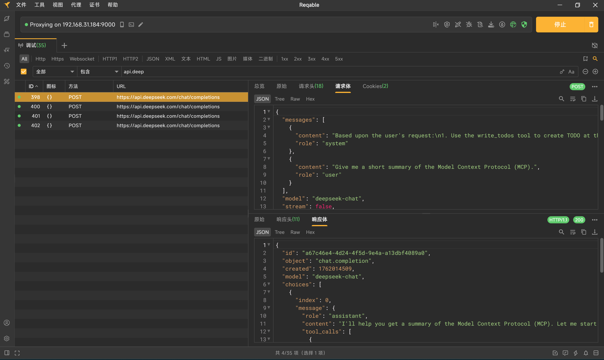

## 课程代码

### Agent定义

```python
from IPython.display import Image, display
from langgraph.prebuilt import create_react_agent


from deep_agents_from_scratch.prompts import TODO_USAGE_INSTRUCTIONS
from deep_agents_from_scratch.state import DeepAgentState
from deep_agents_from_scratch.todo_tools import read_todos, write_todos, web_search


from utils import get_model, format_messages

model = get_model()
tools = [write_todos, web_search, read_todos]

# Add mock research instructions
SIMPLE_RESEARCH_INSTRUCTIONS = """IMPORTANT: Just make a single call to the web_search tool and use the result provided by the tool to answer the user's question."""

system_p = TODO_USAGE_INSTRUCTIONS  + "\n\n" + "=" * 80 + "\n\n" + SIMPLE_RESEARCH_INSTRUCTIONS
# Create agent
agent = create_react_agent(
    model,
    tools,
    prompt=system_p,
    state_schema=DeepAgentState,
)

# Show the agent
display(Image(agent.get_graph(xray=True).draw_mermaid_png()))

# Example usage
result = agent.invoke(
    {
        "messages": [
            {
                "role": "user",
                "content": "Give me a short summary of the Model Context Protocol (MCP).",
            }
        ],
        "todos": [],
    }
)

format_messages(result["messages"])
```

### 状态定义

```python
"""State management for deep agents with TODO tracking and virtual file systems.

This module defines the extended agent state structure that supports:
- Task planning and progress tracking through TODO lists
- Context offloading through a virtual file system stored in state
- Efficient state merging with reducer functions for files field
"""

from typing import Annotated, Literal, NotRequired
from typing_extensions import TypedDict

from langgraph.prebuilt.chat_agent_executor import AgentState


class Todo(TypedDict):
    """A structured task item for tracking progress through complex workflows

    Attributes:
        content: Short, specific description of the task
        status: Current state - pending, in_progress, or completed
    """

    content: str
    status: Literal["pending", "in_progress", "completed"]

def file_reducer(left, right):
    """Merge two file dictionaries, with right side taking precedence.

    Used as a reducer function for the files field in agent state,
    allowing incremental updates to the virtual file system.

    Args:
        left: Left side dictionary (existing files)
        right: Right side dictionary (new/updated files)

    Returns:
        Merged dictionary with right values overriding left values
    """
    if left is None:
        return right
    elif right is None:
        return left
    else:
        return {**left, **right}

class DeepAgentState(AgentState):
    """Extended agent state that includes task tracking and virtual file system.

    Inherits from LangGraph's AgentState and adds:
    - todos: List of Todo items for task planning and progress tracking
    - files: Virtual file system stored as dict mapping filenames to content
    """

    todos: NotRequired[list[Todo]]
    files: Annotated[NotRequired[dict[str, str]], file_reducer]
```

### 工具定义

```python
"""TODO management tools for task planning and progress tracking.

This module provides tools for creating and managing structured task lists
that enable agents to plan complex workflows and track progress through
multi-step operations.
"""

from typing import Annotated

from langchain_core.messages import ToolMessage
from langchain_core.tools import InjectedToolCallId, tool
from langgraph.prebuilt import InjectedState
from langgraph.types import Command

from deep_agents_from_scratch.prompts import WRITE_TODOS_DESCRIPTION
from deep_agents_from_scratch.state import DeepAgentState, Todo


@tool(description=WRITE_TODOS_DESCRIPTION,parse_docstring=True)
def write_todos(
    todos: list[Todo], tool_call_id: Annotated[str, InjectedToolCallId]
) -> Command:
    """Create or update the agent's TODO list for task planning and tracking.

    Args:
        todos: List of Todo items with content and status
        tool_call_id: Tool call identifier for message response

    Returns:
        Command to update agent state with new TODO list
    """
    return Command(
        update={
            "todos": todos,
            "messages": [
                ToolMessage(f"Updated todo list to {todos}", tool_call_id=tool_call_id)
            ],
        }
    )


@tool(parse_docstring=True)
def read_todos(
    state: Annotated[DeepAgentState, InjectedState],
    tool_call_id: Annotated[str, InjectedToolCallId],
) -> str:
    """Read the current TODO list from the agent state.

    This tool allows the agent to retrieve and review the current TODO list
    to stay focused on remaining tasks and track progress through complex workflows.

    Args:
        state: Injected agent state containing the current TODO list
        tool_call_id: Injected tool call identifier for message tracking

    Returns:
        Formatted string representation of the current TODO list
    """
    todos = state.get("todos", [])
    if not todos:
        return "No todos currently in the list."

    result = "Current TODO List:\n"
    for i, todo in enumerate(todos, 1):
        status_emoji = {"pending": "⏳", "in_progress": "🔄", "completed": "✅"}
        emoji = status_emoji.get(todo["status"], "❓")
        result += f"{i}. {emoji} {todo['content']} ({todo['status']})\n"

    return result.strip()


# Mock search result
search_result = """The Model Context Protocol (MCP) is an open standard protocol developed 
by Anthropic to enable seamless integration between AI models and external systems like 
tools, databases, and other services. It acts as a standardized communication layer, 
allowing AI models to access and utilize data from various sources in a consistent and 
efficient manner. Essentially, MCP simplifies the process of connecting AI assistants 
to external services by providing a unified language for data exchange. """


# Mock search tool
@tool(parse_docstring=True)
def web_search(
    query: str,
):
    """Search the web for information on a specific topic.

    This tool performs web searches and returns relevant results
    for the given query. Use this when you need to gather information from
    the internet about any topic.

    Args:
        query: The search query string. Be specific and clear about what
               information you're looking for.

    Returns:
        Search results from search engine.

    Example:
        web_search("machine learning applications in healthcare")
    """
    return search_result
```

## 实践总结

### 1. Jupyter 魔法命令：`%%writefile`

- **用途：** 这是一个 Jupyter Notebook/Google Colab 中的“魔法命令”。
- **功能：** 它将其所在的整个代码单元格（cell）的内容**写入到一个指定的文件中**。
- **示例：** `%%writefile ./my_script.py` 会创建（或覆盖）一个名为 `my_script.py` 的文件，并将单元格中的所有代码放入该文件中。这是在 Notebook 环境中直接创建 `.py` 脚本的快捷方式。

### 2. Python 字典解包：`{**left, **right}` 

- **用途：** 这是 Python 3.5+ 中一种**合并两个字典**的简洁语法。
- **功能：** `**` 运算符会“解包”字典。这行代码会创建一个新字典，先填入 `left` 的所有键值对，然后填入 `right` 的所有键值对。
- **关键行为：** 如果 `left` 和 `right` 有相同的键（key），**`right` 中的值会覆盖 `left` 中的值**。这在你代码中的 `file_reducer` 函数中非常重要，它实现了“右侧优先”的更新逻辑。

### 3. Python 类型提示 (Type Hinting)

类型提示（Type Hinting）不改变代码的运行逻辑，但能极大提高代码的可读性，并帮助代码编辑器和检查工具（如 MyPy）在**运行前**就发现潜在的错误。

#### `TypedDict` (类型化字典)

- **用途：** 来自 `typing` 或 `typing_extensions` 库，用于为字典**定义一个固定的结构**。
- **功能：** 它允许你声明一个字典*必须*包含哪些键，以及每个键对应的*值*应该是哪种数据类型。
- **示例：** `class Todo(TypedDict): content: str` 定义了一个类型，任何被标注为 `Todo` 的变量都必须是一个字典，且必须有一个键 `content`，其值必须是字符串。

#### `NotRequired` (非必需键)

- **用途：** 专用于 `TypedDict`（或 LangGraph `AgentState` 这种类字典结构）。
- **功能：** 它标记 `TypedDict` 中的某个键是**可选的**，不是必须存在的。
- **示例：** `class State(TypedDict): todos: NotRequired[list]` 意味着在 `State` 字典中，`todos` 这个键可以存在，也可以不存在。这在 LangGraph 的 agent 状态管理中很有用，因为不是每一步都会更新所有状态。

### 4. LangChain 工具定义：`@tool` 

`@tool` 装饰器是将一个 Python 函数转换为 AI (LLM) 可以调用的工具的核心。

#### `parse_docstring=True`

- **用途：** 这是一个传递给 `@tool` 装饰器的参数。
- **功能：** 它告诉装饰器去**自动解析**该函数下方的文档字符串（docstring，即 `"""..."""` 中的内容），特别是 `Args:` (或 `Parameters:`) 部分。
- **目的：** 它会提取出你为每个参数（argument）编写的描述文字，并将这些描述信息提供给 AI。这能帮助 AI 更准确地理解**每个参数的含义**，从而更智能地调用该工具。

#### `parse_docstring` 的默认值与设计哲学

- **默认值：** `parse_docstring` **默认为 `False`**。
- **不设置会怎样：** 如果不设置（即使用默认的 `False`），`@tool` 装饰器**不会**去解析 `Args:` 部分。AI 仍然知道工具的参数名称（如 `todos`）和类型（如 `list[Todo]`），但**不知道**这些参数的具体描述（即“这个参数是用来干嘛的”）。
- **为何不默认开启：**
  1. **健壮性：** 开启此功能依赖于**严格的 docstring 格式**（如 Google 风格）。如果默认开启，任何开发者不规范的注释都可能导致程序在解析时报错。默认 `False` 保证了代码的稳定运行。
  2. **明确性：** 遵循 Python 的“显式优于隐式”哲学。当你手动写入 `parse_docstring=True` 时，你是在明确地告诉系统：“我知道这个功能，并且我已确保我的 docstring 格式正确。”
  3. **替代方案：** 在复杂的工具中，更推荐使用 Pydantic 模型（通过 `args_schema` 参数）来定义参数，它提供了更强大、更明确的验证和描述功能。

## LLM API请求拦截

环境说明：`LangChain (Docker Container)` --> `WSL2` --> `Windows 11 Host (Reqable)` --> `Internet (DeepSeek)`

使用Reqable代理代理所有LLM API请求

- 启动Reqable，默认会开启9000端口作为代理服务

- 创建自定义客户端并在模型中使用

  - ```python
    from langchain_openai import ChatOpenAI
    import os
    import httpx
    PROXY_URL = "http://host.docker.internal:9000"
    # 1. 创建 httpx 客户端
    client = httpx.Client(
        # 2. 设置代理
        proxy=PROXY_URL,
        # 3. 信任 Reqable 的证书 (在容器内进行证书验证很麻烦)，对于本地调试，直接跳过验证是最简单的方法。
        verify=False
    )
    model = ChatOpenAI(
        openai_api_key=os.getenv("DEEPSEEK_API_KEY"),
        openai_api_base=os.getenv("DEEPSEEK_API_BASE_URL"),
        model="deepseek-chat",
        http_client=client  # <-- 在这里使用配置好的客户端
    )
    ```

  - 说明：Docker Desktop（在 WSL2 模式下）提供了一个特殊的 DNS 名称来解决这个问题：`host.docker.internal`。这个地址**在容器内部**会被自动解析为 Windows 11 主机的 IP 地址。
  - 拦截结果：
  - 